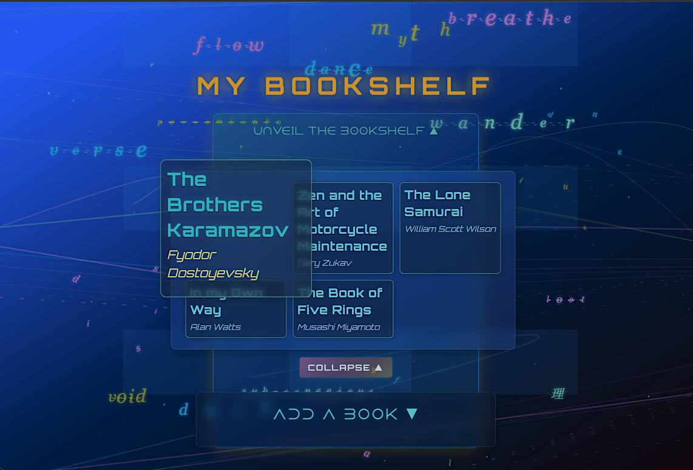
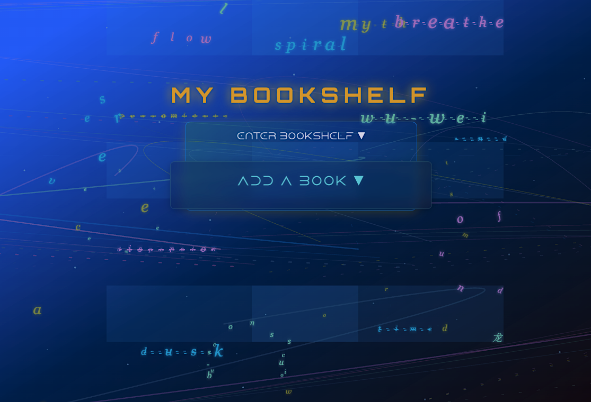
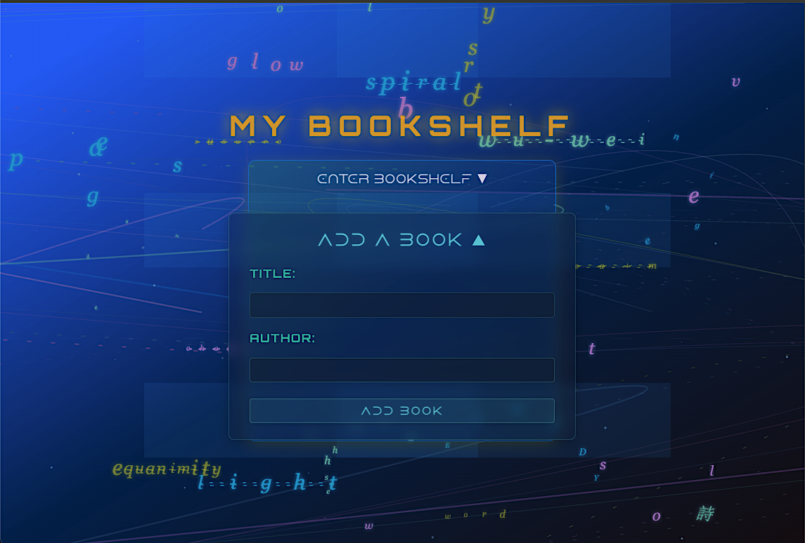
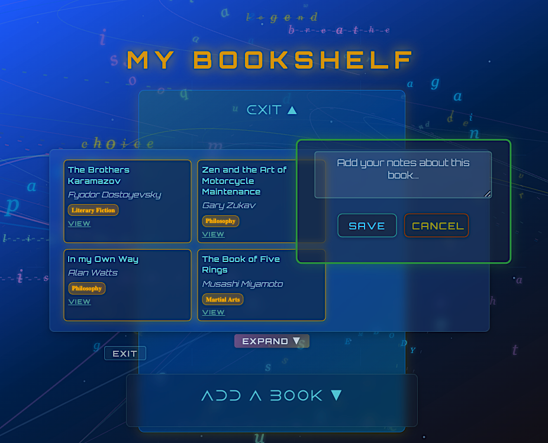
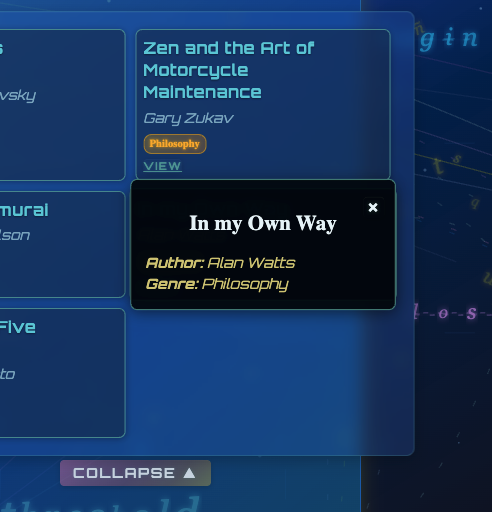
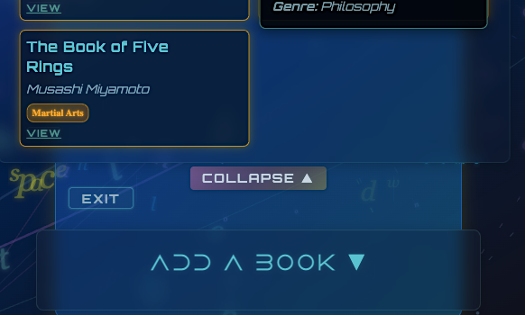
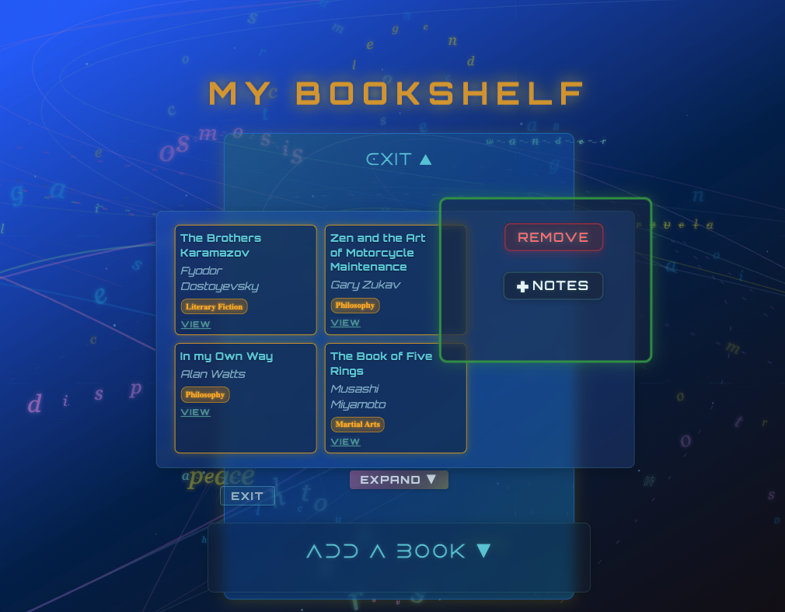

# 📚 Quantum Literary Bookshelf

> A React bookshelf application featuring an animated quantum particle system where words decompose, transform, and recombine - visualizing language as living consciousness.

---

## 🌌 The Concept

This project creates a "living library of consciousness" where words exist as quantum particles in a literary universe. Letters break apart at the atomic level, disperse in circular patterns, drift through chaos where they morph and recombine, then coalesce into entirely new words - all connected by glowing threads representing quantum entanglement. There is no claim of being in expert in these fields of study. Inspiration merely was drawn from intriguing and revolutionary theories as a curious layperson.

**Mathematical foundation:** Experimentation with the Golden ratio (φ = 1.618...) for spatial harmony and Pi for circular distributions to generate (theoretically) naturally beautiful positioning. Each word has its own "personality" - philosophical terms move slowly, Chinese characters pulse larger, mystical words leave ethereal trails.

---

## 🎯 From Lab to Quantum Universe

**Started as:** General Assembly lab on Controlled Forms in React
Evolved into: An exploration of quantum physics visualization, advanced React patterns, SVG animation, and multilingual poetry—developed collaboratively with Claude AI as a learning tool and creative partner.

**Evolved into:** This project is being submitted late, but the extra time has been spent genuinely trying to understand the code rather than just making it work. I'm still actively studying many of these concepts—React performance optimization, mathematical animation, SVG manipulation—and revisiting sections to deepen my comprehension. The quantum animation system, in particular, uses patterns that initially felt beyond my reach, and honestly, some still do. It's an arduous part of the learning process: submitting work that challenges you while acknowledging there's still more to understand.

**Core Requirements Met:**

- ✅ Component with `useState` for state management
- ✅ Controlled form with `handleInputChange` and `handleSubmit`
- ✅ Dynamic rendering with `.map()`
- ✅ Books array with title and author fields

---

## 🌿 Branching Strategy & Project Versions

To preserve the original artistic vision while ensuring practical performance, this project is managed across multiple branches. Each branch serves a distinct purpose, representing a different version of the application.

### `main` (The Artistic Master)

- **Purpose:** This branch holds the original, uncompromised "director's cut" of the animation.
- **Details:** It features the full O(n²) "quantum entanglement" effect, where any letter particle can connect with any other, creating a truly holistic and unpredictable system. This is the high-fidelity master version, preserved as the creative gold standard.

### `bookshelf-optimus` (The Optimized Release)

- **Purpose:** This branch represents the performance-optimized version of the expanded "Quantum Literary Bookshelf" project, which evolved far beyond the original `controlled-forms-in-react-lab` assignment. It is the recommended version for live deployment.
- **Details:** This branch makes a subtle but critical trade-off for performance. The expensive O(n²) particle connection logic from the `main` branch is replaced with a more efficient O(n\*k) approach, limiting checks to nearby particles. The visual difference is negligible, but the performance gain is significant, ensuring a smooth user experience on a wider range of devices.

### `bookshelf-obscuritas` (The Experimental Lab)

- **Purpose:** A future development branch for creative exploration.
- **Details:** This branch is planned for experimenting with a new dark visual theme and alternative animation concepts, providing a sandbox for new ideas without affecting the stable versions.

---

## 📸 Screenshots

### Main Interface


_The main bookshelf displaying book cards with the animated background_

### Homepage Collapsed View


_The main bookshelf displaying book cards with the animated background_

### Add Book Form


_Collapsible form for adding new books to the collection_

### Expanded View


_Expanded grid view with larger book cards_

### Notes



_Modal pop-up to add notes_

### View


_Modal pop-up to view notes_

### Edit


_Card borders are highlighted when editing notes_

### Remove or Delete


_Removal of item in bookshelf_

## ✨ Key Features

### 1. **Quantum Animated Background**

- **21 multilingual word sequences** (English, Spanish, Chinese, esoteric terms)
- **Letter-level particle physics** with four animation phases:
  1. Formation (0-30%): Letters spiral in
  2. Stable (30-60%): Gentle quantum drift
  3. Dispersion (60-75%): Circular scatter patterns
  4. Chaos (75-100%): Letters morph into new words
- **Performance optimized** with `useMemo` and `useCallback`
- **Accessibility** with `prefers-reduced-motion` support

### 2. **Interactive Bookshelf**

- Progressive disclosure UI with collapsible sections
- Grid layout that expands from 150px to 250px cards
- Glassmorphism styling with backdrop blur
- Hover effects with neon cyan glow

### 3. **Controlled Form Pattern**

```javascript
const handleInputChange = (e) => {
  const { name, value } = e.target;
  setNewBook({ ...newBook, [name]: value });
};

const handleSubmit = (e) => {
  e.preventDefault();
  setBooks([...books, newBook]);
  setNewBook({ title: "", author: "" });
};
```

---

## 🛠️ Tech Stack

- **React 18** - Hooks (useState, useEffect, useMemo, useCallback)
- **Vite** - Build tool
- **SVG** - Vector animations
- **CSS3** - Grid, Flexbox, glassmorphism

---

## 📁 Project Structure

```
controlled-forms-in-react-lab/
├── node_modules/
├── public/
│   ├── fonts/                 # Custom typography (7 font files)
│   ├── service-worker.js
│   └── vite.svg
├── screenshots/               # Documentation images
│   ├── add-book-form.png
│   ├── bookshelf-view.png
│   ├── expanded-view.png
│   └── home-page.png
├── src/
│   ├── assets/
│   │   └── react.svg
│   ├── components/
│   │   ├── BookCard/
│   │   │   ├── BookCard.css
│   │   │   └── BookCard.jsx
│   │   ├── BookForm/
│   │   │   ├── BookForm.css
│   │   │   └── BookForm.jsx
│   │   ├── Bookshelf/
│   │   │   ├── Bookshelf.css
│   │   │   └── Bookshelf.jsx
│   │   ├── GeometricBg/       # Quantum animation system
│   │   │   ├── GeometricBg.css
│   │   │   └── GeometricBg.jsx
│   │   └── ToggleButton/
│   │       ├── ToggleButton.css
│   │       └── ToggleButton.jsx
│   ├── utils/
│   │   └── formHandlers.js
│   ├── App.css
│   ├── App.jsx
│   ├── index.css
│   └── main.jsx
├── .gitignore
├── eslint.config.js
├── index.html
├── package.json
├── package-lock.json
├── README.md
└── vite.config.js
```

---

## 🚀 Getting Started

```bash
# Clone and install
git clone https://github.com/yourusername/quantum-bookshelf.git
cd quantum-bookshelf
npm install

# Development
npm run dev          # Start dev server at localhost:5173

# Production
npm run build        # Build for production
npm run preview      # Preview production build
```

---

## 🎨 Design Philosophy

**Glassmorphism Aesthetic**

- Transparent backgrounds with frosted glass blur
- Neon accents (cyan #00fff2, teal #5DB4A6)
- Layered shadows for depth

**Mathematical Inspiration**

- Golden ratio for spatial harmony
- Quantum mechanics analogies (non-locality, uncertainty)
- String theory curved connections
- Trigonometric functions for organic motion

---

## 📖 Key Learning Outcomes

**React Fundamentals**

- State management and controlled forms
- Component composition and event handling
- Performance optimization with memoization
- Accessibility considerations

**Advanced Concepts**

- SVG animation with React
- Mathematical programming (golden ratio, trigonometry)
- Modern CSS (grid, glassmorphism, fluid typography)
- Particle systems and physics simulation

---

## 🎯 Future Enhancements

- [ ] LocalStorage for data persistence
- [ ] Delete and edit book functionality
- [ ] Search and filter capabilities
- [ ] Book cover image uploads
- [ ] Dark/light theme toggle
- [ ] Export to PDF/CSV

---

## 🤝 Contributing

Contributions welcome! Areas for improvement:

- Additional multilingual word sequences
- Performance optimizations
- Accessibility enhancements
- Bug fixes

---

## 📝 License

MIT License - free to use for learning and inspiration!

---

## 🙏 Credits

**Assignment:** General Assembly - Software Engineering Immersive  
**Inspiration:** Quantum mechanics, string theory, golden ratio, hypnagogic states  
**Fonts:** Lamoric Rowen, Orbitron, Dune Rise, Creato Display

---

**From a simple form lab to a quantum literary cosmos** ✨

Built with React, assisted and refined with Claude AI and an exploratory creative, digital interpretation on how language lives and breathes, somewhere in the either.
