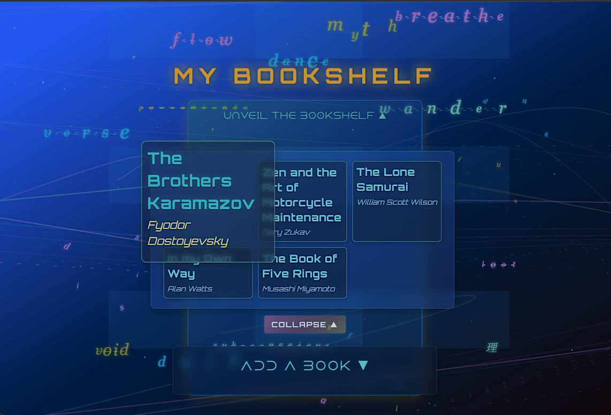
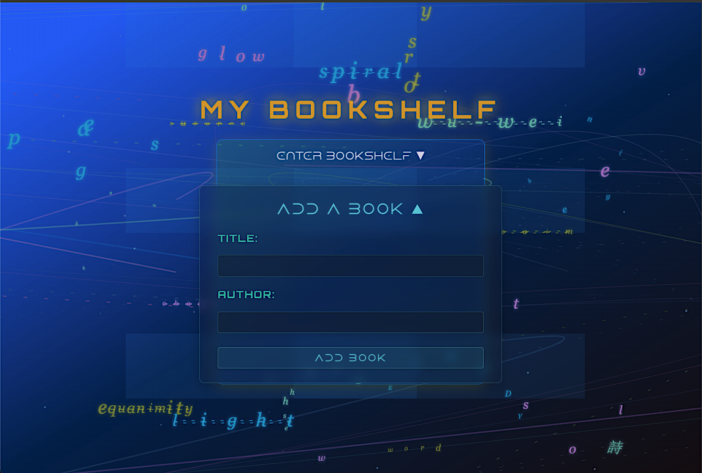
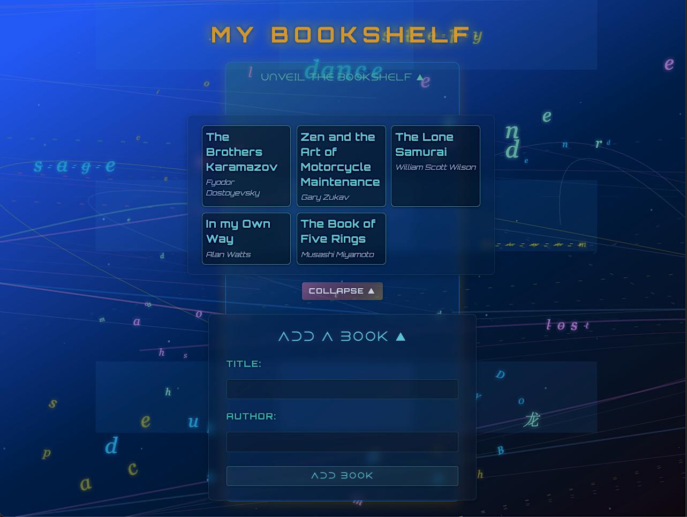

# 📚 Interactive Bookshelf Application

> A React application for managing a personal bookshelf with controlled forms, featuring a cyberpunk-inspired design with custom SVG animations.

---

## 🎯 Assignment Overview

This project demonstrates React fundamentals by building a bookshelf manager where users can add books through a controlled form. Books are stored in state and dynamically rendered as cards.

### Core Requirements Met

✅ Component created with `useState`  
✅ State management for books array and form inputs  
✅ `handleInputChange` - updates form as user types  
✅ `handleSubmit` - adds books and clears form  
✅ Controlled form with title and author fields  
✅ Dynamic rendering with `.map()`

---

## 📸 Screenshots

### Main Interface


_The main bookshelf displaying book cards with the animated background_

### Homepage Collapsed View


_The main bookshelf displaying book cards with the animated background_

### Add Book Form


_Collapsible form for adding new books to the collection_

### Expanded View


_Expanded grid view with larger book cards_

### Hover Interaction


_Book card hover state with scale and glow effects_

---

## ⚙️ Technical Implementation

### 1. State Management

```javascript
const [books, setBooks] = useState([...]); // Array of book objects
const [newBook, setNewBook] = useState({ title: '', author: '' }); // Form state
const [isFormVisible, setIsFormVisible] = useState(false); // UI toggles
```

### 2. Event Handlers

**`handleInputChange`** - Updates form state using object destructuring:

```javascript
const handleInputChange = (e) => {
  const { name, value } = e.target;
  setNewBook({ ...newBook, [name]: value });
};
```

**`handleSubmit`** - Adds book to array with spread operator:

```javascript
const handleSubmit = (e) => {
  e.preventDefault();
  setBooks([...books, newBook]); // Immutable update
  setNewBook({ title: "", author: "" }); // Clear form
};
```

### 3. Dynamic Rendering

```javascript
{
  books.map((book, index) => (
    <div key={index} className="bookCard">
      <h3>{book.title}</h3>
      <p>{book.author}</p>
    </div>
  ));
}
```

---

## 🎨 Design Features

### Animated Background


- Custom SVG component built with React hooks
- 20 word sequences that morph and transition
- Golden ratio mathematics for layout
- Performance optimized with `useMemo`

### Glassmorphism UI

- Transparent backgrounds (0.25-0.4 opacity)
- `backdrop-filter: blur(12px)` for frosted glass effect
- Layered shadows for depth
- Subtle neon accents in cyan and teal

### Interactive Elements

- **Collapsible sections**: Click to reveal/hide bookshelf and form
- **Expand/Collapse**: Toggle between compact (150px) and expanded (250px) grid
- **Hover effects**: Cards scale 1.5x and lift to foreground
- **Color transitions**: Cyan text glows on hover, authors turn golden yellow

### Responsive Design

```css
/* Auto-fitting grid */
grid-template-columns: repeat(auto-fit, minmax(150px, 1fr));

/* Fluid typography */
font-size: clamp(1.1rem, 2vw, 1.35rem);
```

---

## 🚀 Enhanced Features (Beyond Requirements)

1. **Custom Animated Background**

   - Pure React/SVG implementation (no libraries)
   - Trigonometric functions for organic motion
   - 40 floating particles with independent animations

2. **Progressive Disclosure UI**

   - Collapsible bookshelf and form sections
   - Reduces visual clutter
   - Improves user focus

3. **Advanced Styling**
   - CSS Grid with auto-fit
   - Custom fonts (Orbitron, Dune Rise)
   - Accessibility features (reduced motion support)
   - Mobile responsive with media queries

---

## 🛠️ Technologies

- **React 18** - Hooks (useState, useEffect, useMemo)
- **Vite** - Build tool
- **CSS3** - Grid, Flexbox, backdrop-filter, clamp()
- **SVG** - Custom animations

---

## 📁 Project Structure

```
src/
├── App.jsx                    # Main component
├── components/
│   ├── Bookshelf/
│   │   ├── Bookshelf.jsx     # Bookshelf with state & handlers
│   │   └── Bookshelf.css     # Styles
│   └── GeometricBg/
│       ├── GeometricBg.jsx   # Animated background
│       └── GeometricBg.css   # Background styles
└── fonts/                     # Custom typography
```

---

## 🚀 Getting Started

```bash
# Install dependencies
npm install

# Start dev server
npm run dev

# Open http://localhost:5173
```

---

## 📖 Key Learnings

### React Concepts

- Controlled form components
- State management with `useState`
- Immutable state updates with spread operator
- Event handling (onChange, onSubmit, onClick)
- Conditional rendering
- List rendering with `.map()` and keys

### Advanced Techniques

- Performance optimization with `useMemo`
- Side effects with `useEffect` (intervals, cleanup)
- Component composition
- CSS Grid responsive layouts
- SVG animation with React

### Design Principles

- Progressive disclosure for UX
- Glassmorphism and depth perception
- Accessibility considerations
- Balance between aesthetics and readability

---

## 🎯 Future Enhancements

- [ ] localStorage persistence
- [ ] Delete book functionality
- [ ] Edit existing books
- [ ] Search/filter books
- [ ] Sort by title or author
- [ ] Book cover images
- [ ] Reading status tracking

---

## 📸 Image Upload Guide

**Create a `screenshots/` folder in your project root and add these images:**

1. **full-app.png** - Full page view showing title, bookshelf, and form
2. **bookshelf-view.png** - Close-up of the book cards grid
3. **add-book-form.png** - Form in expanded state with inputs visible
4. **expanded-view.png** - Grid in expanded mode (250px columns)
5. **hover-effect.png** - Capture of a book card mid-hover (scaled up)
6. **background-animation.gif** - Screen recording of the word morphing (optional)

**How to capture:**

- Use browser screenshot tools (F12 → Device Toolbar → Screenshot)
- Or use tools like Snagit, Lightshot, or macOS Screenshot (Cmd+Shift+4)
- For GIF: Use LICEcap or ScreenToGif for the animated background

---

## 👤 Author

**[Your Name]**  
General Assembly - Software Engineering Immersive  
[Your GitHub](https://github.com/yourusername) | [Portfolio](https://yoursite.com)

---

## 🙏 Acknowledgments

- Assignment by General Assembly
- Fonts: Orbitron, Dune Rise
- Inspired by cyberpunk aesthetics and modern UI design

---

_Assignment completed with ❤️ demonstrating React fundamentals and creative enhancement_
